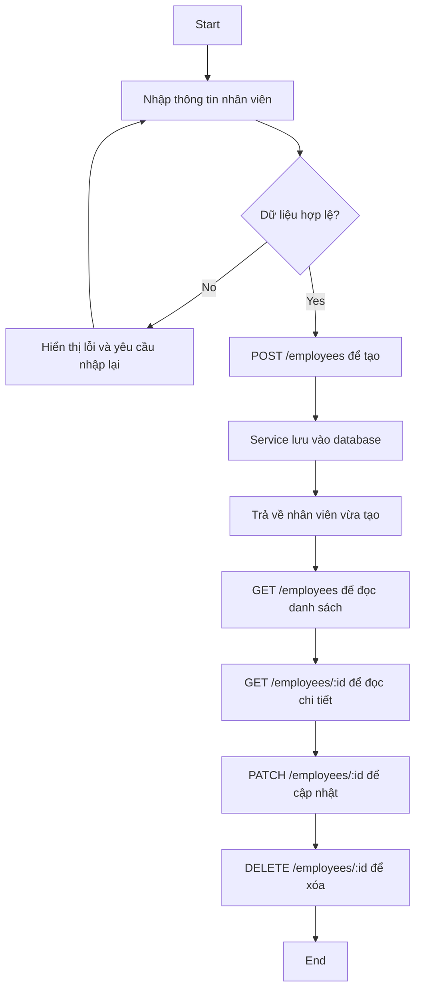

# Activity Diagram cho CRUD Employee

- Tạo: `POST /employees`
- Đọc danh sách: `GET /employees`
- Đọc chi tiết: `GET /employees/:id`
- Cập nhật: `PATCH /employees/:id`
- Xóa: `DELETE /employees/:id`
