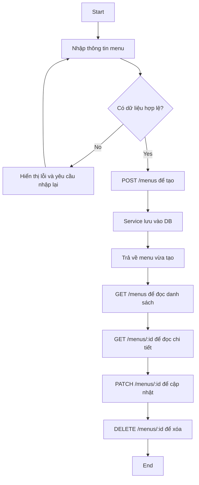

# Activity Diagram cho CRUD Menu

```mermaid
flowchart TD
    A[Start] --> B[Nhập thông tin menu]
    B --> C{Có dữ liệu hợp lệ?}
    C -- No --> D[Hiển thị lỗi và yêu cầu nhập lại]
    D --> B
    C -- Yes --> E[POST /menus để tạo]
    E --> F[Service lưu vào DB]
    F --> G[Trả về menu vừa tạo]

    G --> H[GET /menus để đọc danh sách]
    H --> I[GET /menus/:id để đọc chi tiết]
    I --> J[PATCH /menus/:id để cập nhật]
    J --> K[DELETE /menus/:id để xóa]
    K --> L[End]
```

- Tạo: `POST /menus`
- Đọc danh sách: `GET /menus`
- Đọc chi tiết: `GET /menus/:id`
- Cập nhật: `PATCH /menus/:id`
- Xóa: `DELETE /menus/:id`
