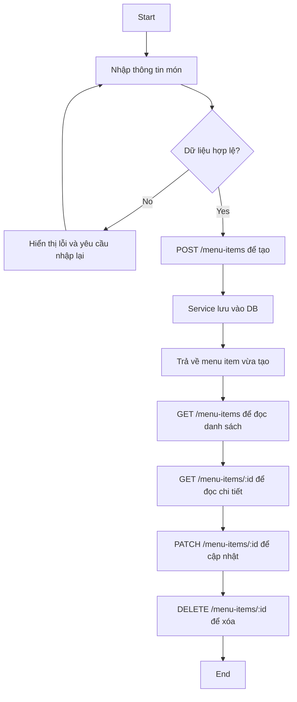

# Activity Diagram cho CRUD Menu Item

- Tạo: `POST /menu-items`
- Đọc danh sách: `GET /menu-items`
- Đọc chi tiết: `GET /menu-items/:id`
- Cập nhật: `PATCH /menu-items/:id`
- Xóa: `DELETE /menu-items/:id`
