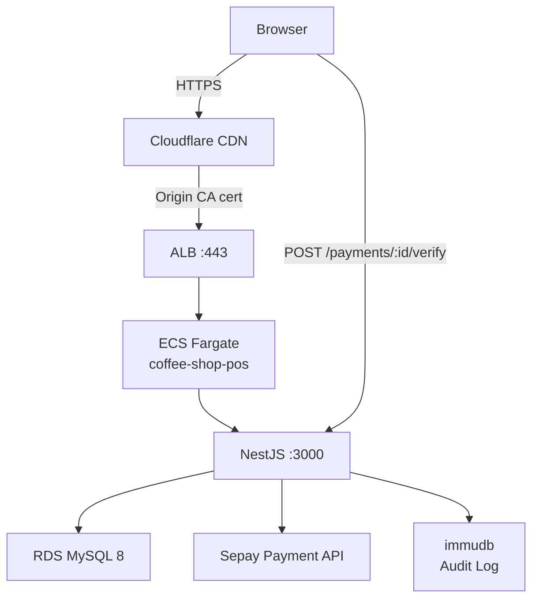
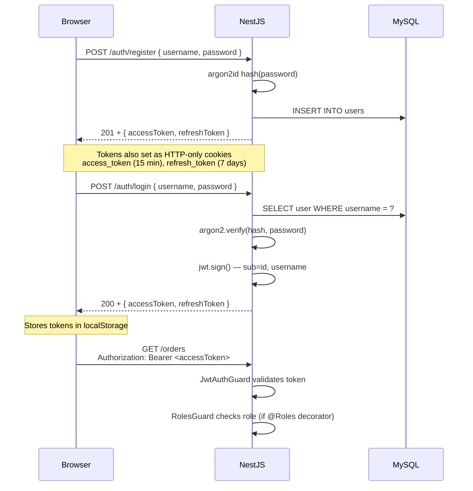
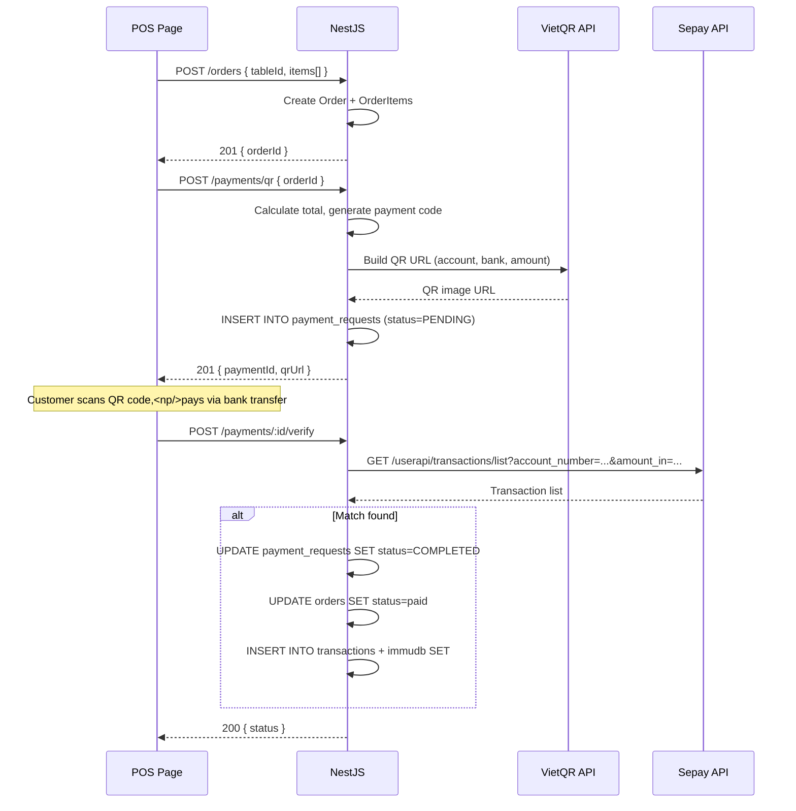
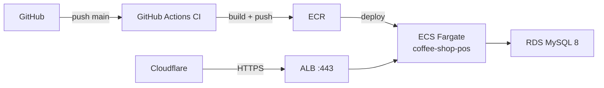

# System Architecture

Coffee shop POS/management system.

## Overview

| Layer | Technology | Version |
|-------|-----------|---------|
| Backend | NestJS (TypeScript, CommonJS) | 11 |
| Frontend | React (TypeScript, ES modules) | 19 |
| Build | Vite | 8 |
| Database | MySQL | 8 |
| ORM | TypeORM | 0.3 |
| Auth | JWT + argon2id | — |
| Payment | Sepay API + VietQR | — |
| Hosting | AWS ECS Fargate + RDS | — |
| Audit Log | immudb | 1.9 |

## Architecture Diagram



## Backend Architecture

### Request Flow

```
HTTP Request
  → Global Pipes (ValidationPipe: whitelist + transform)
  → Controller
  → Service
  → TypeORM Repository
  → MySQL
```

All inbound requests pass through a global `ValidationPipe` configured with `whitelist: true` and `transform: true`, which strips unknown DTO properties and auto-transforms payloads to DTO types. An `AllExceptionsFilter` provides unified error responses.

### Modules

| Module | Directory | Responsibility |
|--------|-----------|---------------|
| `AppModule` | `src/app.module.ts` | Root module, wires all feature modules |
| `ConfigModule` | `@nestjs/config` | Environment variable loading |
| `AuthModule` | `src/auth/` | JWT authentication, registration, login, profile, token refresh, role guards |
| `UsersModule` | `src/users/` | User CRUD |
| `MenuModule` | `src/menus/` | Menu category CRUD |
| `MenuItemModule` | `src/menu-items/` | Menu item CRUD |
| `TableModule` | `src/tables/` | Table CRUD |
| `EmployeeModule` | `src/employees/` | Employee CRUD, FK → User |
| `OrderModule` | `src/orders/` | Order and order-item management |
| `PaymentModule` | `src/payments/` | Payment creation, QR generation, Sepay verification |
| `TransactionsModule` | `src/transactions/` | Transaction history, immudb logging, SePay reverify |

### Entity-to-Table Mapping

TypeORM entities do not always map 1:1 by name. The actual table names are:

| Entity Class | File | Table Name |
|-------------|------|------------|
| `User` | `users/user.entity.ts` | `users` |
| `Menu` | `menus/menu.entity.ts` | `categories` |
| `MenuItem` | `menu-items/menu-item.entity.ts` | `products` |
| `Table` | `tables/table.entity.ts` | `tables` |
| `Order` | `orders/order.entity.ts` | `orders` |
| `OrderItem` | `orders/order-item.entity.ts` | `order_items` |
| `Employee` | `employees/employee.entity.ts` | `employees` |
| `Payment` | `payments/payment.entity.ts` | `payment_requests` |
| `Transaction` | `transactions/transaction.entity.ts` | `transactions` |

All entities use UUID primary keys (`@PrimaryGeneratedColumn('uuid')`).

### Key Dependencies

- `@nestjs/passport` + `passport-jwt` — JWT strategy
- `@nestjs/jwt` — token signing/verification
- `argon2` — password hashing (argon2id variant)
- `cookie-parser` — parses HTTP-only cookies
- `express-session` — session middleware
- `class-validator` / `class-transformer` — DTO validation
- `@nestjs/throttler` — rate limiting
- `@nestjs/swagger` — OpenAPI documentation
- `@nestjs/axios` — HTTP client for Sepay API calls
- `typeorm` + `mysql2` — database access
- `immudb-node` — immudb gRPC client for immutable audit logging

## Frontend Architecture

### Routing

React Router v7 handles client-side routing. Protected routes wrap pages in `<ProtectedRoute>` → `<AppLayout>` (sidebar + nav).

| Route | Page | Auth Required |
|-------|------|:---:|
| `/login` | `LoginPage` | No |
| `/register` | `RegisterPage` | No |
| `/dashboard` | `DashboardPage` | Yes |
| `/pos` | `POSPage` | Yes |
| `/menus` | `MenuManagementPage` | Yes |
| `/menu-items` | `MenuItemManagementPage` | Yes |
| `/tables` | `TablesPage` | Yes |
| `/manage-tables` | `TableManagementPage` | Yes |
| `/transactions` | `TransactionHistoryPage` | Yes |
| `/settings` | `SettingsPage` | Yes (MANAGER only) |
| `/employees` | `EmployeeManagementPage` | Yes (MANAGER only) |
| `*` | Redirects to `/dashboard` | — |

### Services

All services live in `frontend/src/services/` and delegate to the core `api.ts` client.

| Service | Responsibility |
|---------|---------------|
| `api.ts` | Base HTTP client using native `fetch`; handles auth headers, error wrapping, JSON serialization |
| `auth.service.ts` | Register, login, logout, profile, token management (localStorage) |
| `menu.service.ts` | Menu category CRUD |
| `menuItem.service.ts` | Menu item CRUD |
| `order.service.ts` | Order creation and listing |
| `payment.service.ts` | QR payment initiation and status polling |
| `table.service.ts` | Table CRUD |
| `transaction.service.ts` | Fetch transactions, reverify via SePay |

### Custom Hooks

| Hook | Responsibility |
|------|---------------|
| `useCart` | Shopping cart state management for the POS page |
| `useDashboardStats` | Dashboard statistics fetching |
| `useMenuCategories` | Menu category listing and mutations |
| `useMenuItems` | Menu item listing and mutations |
| `useOrders` | Order listing and creation |
| `usePOSData` | Combined POS page data (categories + items + tables) |

### Components

Reusable components are organized under `frontend/src/components/`:

- **Layout**: `AppLayout` (sidebar navigation), `ProtectedRoute` (auth guard)
- **UI primitives** (`components/ui/`): `Button`, `Card`, `Modal`, `Table`, `Alert`, `Badge`, `Spinner`
- **Domain-specific**: `payment/PaymentModal`, `pos/CartSummary`, `pos/CategoryTabs`, `pos/ProductCard`, `dashboard/StatsCard`, `dashboard/TopItemsTable`

### Styling

CSS files in `frontend/src/styles/`:

| File | Scope |
|------|-------|
| `index.css` | Global reset and typography |
| `auth.css` | Login/register pages |
| `dashboard.css` | Dashboard layout and stats |
| `pos.css` | Point-of-sale interface |

### Internationalization

Two locales via `frontend/src/i18n/`:

- `en.ts` — English
- `vi.ts` — Vietnamese

The `I18nProvider` wraps the entire app tree.

## Authentication



### Token Details

| Token | Lifetime | Storage | Delivery |
|-------|----------|---------|----------|
| Access token | 15 minutes | HTTP-only cookie + localStorage | `Set-Cookie` header; also in JSON response body |
| Refresh token | 7 days | HTTP-only cookie + localStorage | `Set-Cookie` header; also in JSON response body |

The frontend sends the access token via the `Authorization: Bearer` header. The backend also accepts tokens from HTTP-only cookies via `cookie-parser`. A `POST /auth/refresh` endpoint exchanges a valid refresh token for new access/refresh token pair. `POST /auth/logout` clears both cookies.

### Guards

- **`JwtAuthGuard`** — extends Passport's `AuthGuard('jwt')`. Validates the JWT on protected routes.
- **`RolesGuard`** — reads `@Roles()` metadata via `Reflector`. Denies access when the authenticated user's role is not in the required list.

## Role-Based Access Control

The system uses two roles stored in the `users.role` column:

| Role | Access Scope |
|------|-------------|
| `MANAGER` | Full access — all nav items visible (Dashboard, POS, Tables, Menus, Menu Items, Transactions, Settings, Employees) |
| `STAFF` | Limited access — Dashboard, POS, Tables, and Transactions only |

**Frontend routing enforcement:** The `<ProtectedRoute>` component checks the user's role from the profile and conditionally renders nav items. `SettingsPage` and `EmployeeManagementPage` are only accessible to `MANAGER` users; all other authenticated routes are available to both roles.

**Admin account creation:** On first boot, if no users exist in the database, a `MANAGER` user is auto-created from the `ADMIN_USERNAME` and `ADMIN_PASSWORD` environment variables. User registration (`POST /auth/register`) always creates `STAFF` users — there is no way to self-register as a `MANAGER`. Promoting a `STAFF` user to `MANAGER` requires direct database access or an admin panel action.

## Payment Flow



### Payment Entity Fields

| Column | Type | Description |
|--------|------|-------------|
| `id` | UUID | Primary key |
| `order_id` | UUID (FK) | Linked order, CASCADE delete |
| `code` | varchar(12) | Unique payment code |
| `amount` | decimal(12,0) | Amount in VND |
| `status` | enum | `PENDING` / `COMPLETED` / `FAILED` |
| `qr_url` | text | VietQR image URL |
| `sepay_transaction_id` | varchar(36) | Sepay transaction ID (set on verification) |
| `created_at` | timestamp | Auto-generated |
| `updated_at` | timestamp | Auto-updated |

### Sepay Integration

The backend calls the Sepay API at `https://my.sepay.vn/userapi/transactions/list` to verify bank transfers. Verification matches by payment code — the backend scans recent SePay transactions for one whose `transaction_content` contains the payment code AND whose `amount_in` matches the order amount. The account number and bank name are configured via `SEPAY_ACCOUNT_NUMBER` and `SEPAY_BANK_NAME` environment variables.

## Deployment



- **CI/CD**: GitHub Actions (`ci.yml`, `cd.yml`, `deploy-aws.yml`)
- **Container**: Single Docker image containing the NestJS backend (static frontend build served separately or via CDN)
- **ECS Fargate**: 1024 CPU / 2048 MB memory, container port 3000
- **Logs**: CloudWatch Logs group `/ecs/coffee-shop-pos`
- **Secrets**: AWS Secrets Manager for `DB_HOST`, `DB_PASSWORD`, `JWT_SECRET`, `SESSION_SECRET`, `SEPAY_API_KEY`, `SEPAY_ACCOUNT_NUMBER`, `SEPAY_BANK_NAME`, `IMMUDB_PASSWORD`
- **immudb Sidecar**: immudb runs as a sidecar container in the same ECS task, accessible on `localhost:3322`
- **Domain**: `<YOUR_DOMAIN>` via Cloudflare → ALB → ECS

### Environment Variables

| Variable | Description |
|----------|-------------|
| `DB_HOST` | MySQL host (from Secrets Manager in production) |
| `DB_PORT` | MySQL port (default `3306`) |
| `DB_USERNAME` | MySQL user |
| `DB_PASSWORD` | MySQL password (from Secrets Manager in production) |
| `DB_DATABASE` | Database name |
| `DB_SYNC` | Enable TypeORM schema sync (`true` in development) |
| `NODE_ENV` | `development` or `production` |
| `JWT_SECRET` | Secret for JWT signing |
| `SESSION_SECRET` | Secret for express-session |
| `PORT` | NestJS listen port (default `3000`) |
| `FRONTEND_URL` | Allowed CORS origin |
| `SEPAY_API_KEY` | Sepay API authentication key |
| `SEPAY_ACCOUNT_NUMBER` | Bank account number for payment verification |
| `SEPAY_BANK_NAME` | Bank name (e.g. `MBBank`) |
| `INIT_DB_SEED` | Run database seed script on startup |
| `IMMUDB_HOST` | immudb host (default `localhost`) |
| `IMMUDB_PORT` | immudb gRPC port (default `3322`) |
| `IMMUDB_USER` | immudb authentication user |
| `IMMUDB_PASSWORD` | immudb password (from Secrets Manager in production) |
| `IMMUDB_DATABASE` | immudb database name |
| `ADMIN_USERNAME` | Admin user username (auto-created on first boot with MANAGER role) |
| `ADMIN_PASSWORD` | Admin user password (auto-created on first boot with MANAGER role) |
