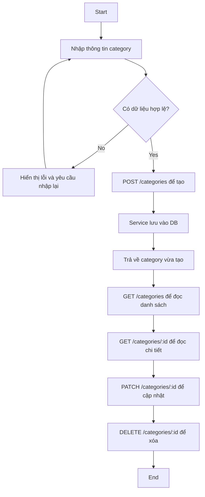

# Activity Diagram cho CRUD Category

- Tạo: `POST /categories`
- Đọc danh sách: `GET /categories`
- Đọc chi tiết: `GET /categories/:id`
- Cập nhật: `PATCH /categories/:id`
- Xóa: `DELETE /categories/:id`
